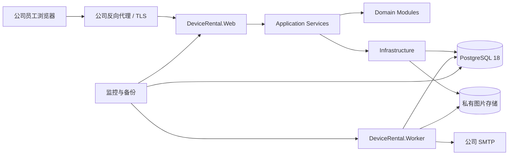
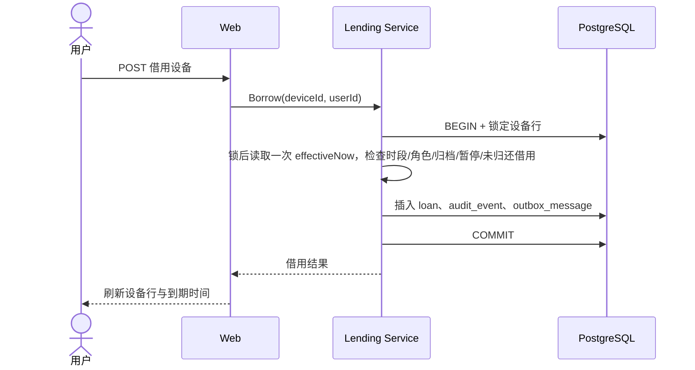

# 手机设备借用管理系统开发设计文档

| 项目 | 内容 |
| --- | --- |
| 文档版本 | v1.0 |
| 文档状态 | 已批准开发 |
| 编制日期 | 2026-09-01 |
| 需求基线 | [需求规格说明书](requirements-specification.md) v1.0 |
| 推荐方案 | `.NET 10 LTS` 模块化单体 |

> 技术负责人已确认本设计基线。实现仍须遵循测试先行、真实 PostgreSQL 验证和生产发布独立批准。

## 1. 设计原则

1. 采用模块化单体，不为当前规模引入微服务、Kubernetes 或独立身份服务。
2. 设备状态从“管理员可用性 + 当前借用记录”派生，避免多个可写状态源漂移。
3. 借用、归还、审计和待发通知在同一数据库事务提交。
4. 以 PostgreSQL 约束守住最终不变量，不能只依赖页面按钮或应用层先查后写。
5. 关闭时段由服务端实时策略判断，不依赖定时任务启停系统。
6. Web 首屏是可操作的设备列表，不建设营销页面；桌面高密度、移动端可扫描。
7. 外部依赖通过端口接口隔离，但只为已知替换点抽象，不预建通用平台。

## 2. 技术路线比较

| 方案 | 组成 | 优点 | 代价与风险 | 结论 |
| --- | --- | --- | --- | --- |
| A | `.NET 10 LTS`、ASP.NET Core Razor Pages/MVC、EF Core/Npgsql、PostgreSQL、HTMX/Tailwind、独立 Worker | 强类型；Identity、授权、健康检查和后台服务成熟；Web 与 Worker 共用领域代码；无需独立 SPA/Redis | 团队需具备 C#/.NET 维护能力 | 推荐，前提是团队接受 C# |
| B | Python、Django 5.2 LTS、Templates/HTMX、PostgreSQL、Celery 或数据库 Worker | CRUD 和管理界面交付快，内建认证与后台成熟 | 动态类型；可靠异步任务通常增加 Celery/Redis；团队需维护 Python | 若团队以 Python 为主则选择 |
| C | React/Vite、NestJS、PostgreSQL、Redis/BullMQ | 前后端统一 TypeScript；独立 API 适合后续多客户端 | SPA、API、会话、Worker、Redis 都需单独维护，首版升级面最大 | 仅在已有 Node/React 平台时选择 |

推荐 A 的依据：该系统是内部事务型操作工具，核心难点是权限、一致性、定时提醒和审计，而不是复杂前端状态。`.NET 10` 当前为 LTS，ASP.NET Core Identity 覆盖用户、密码、角色、令牌和邮箱确认；PostgreSQL 18 具备长期支持窗口。版本事实参考 [.NET 支持策略](https://dotnet.microsoft.com/en-us/platform/support/policy/dotnet-core)、[ASP.NET Core Identity](https://learn.microsoft.com/en-us/aspnet/core/security/authentication/identity?view=aspnetcore-10.0) 和 [PostgreSQL 版本策略](https://www.postgresql.org/support/versioning/)。

启动开发时锁定当日最新安全补丁，不在文档阶段写死补丁号。若技术负责人否决 C#，业务模型、数据库约束和测试策略保持不变，仅将宿主替换为方案 B。

## 3. 推荐技术栈

| 层面 | 选择 | 说明 |
| --- | --- | --- |
| 运行时 | .NET 10 LTS | 生产必须跟进 10.x 安全补丁 |
| Web | ASP.NET Core Razor Pages + 少量 MVC 命令端点 | 同源 Cookie 会话，服务端渲染为主 |
| 渐进交互 | HTMX 2.x | 筛选、局部刷新、操作反馈；原生表单仍可降级工作 |
| 样式 | Tailwind CSS 4.x + 自有语义令牌 | 安静、紧凑的内部操作台，不使用营销式大标题 |
| 认证授权 | ASP.NET Core Identity + Policy Authorization | 邮箱确认、密码重置、角色和对象级策略 |
| 数据访问 | EF Core + Npgsql | 迁移、事务、乐观并发和 PostgreSQL 特性 |
| 数据库 | PostgreSQL 18 | 事务、部分唯一索引、行锁、JSONB 审计快照 |
| 后台任务 | 独立 .NET Worker + PostgreSQL Outbox | 与 Web 共用代码，无需首版引入 Redis |
| 图片存储 | 私有 S3 兼容对象存储；单机可用受备份保护的持久卷 | 数据库只存元数据和对象 key |
| 邮件 | 公司 SMTP | 验证、重置、借用和到期通知 |
| 部署 | Linux VM + Docker Compose + 公司反向代理 | Web、Worker、PostgreSQL、可选对象存储 |
| 测试 | xUnit、Testcontainers、Playwright、k6、axe-core | 见测试文档 |

HTMX 采用渐进增强，链接和表单保留原生 `href`、`action` 和 `method`，参考 [HTMX 文档](https://htmx.org/docs/)。响应式实现遵循移动优先断点，参考 [Tailwind 响应式设计](https://tailwindcss.com/docs/responsive-design)。

## 4. 总体架构



Web 和 Worker 是两个进程、一个代码库、一个数据库。Web 处理交互请求；Worker 领取到期的 Outbox 任务并发送邮件。领域逻辑只能通过应用服务调用，Razor Page 或 Controller 不直接跨模块写数据库。

## 5. 代码组织

建议解决方案结构：

```text
Mobile-Device-Rental-Management-System.sln
src/
  DeviceRental.Domain/          # 实体、值对象、状态规则、领域错误
  DeviceRental.Application/     # 用例、授权端口、事务边界、DTO
  DeviceRental.Infrastructure/  # EF Core、Identity、对象存储、邮件、Outbox
  DeviceRental.Web/             # Razor Pages、命令端点、中间件、静态资源
  DeviceRental.Worker/          # Outbox 领取、提醒、重试、死信
tests/
  DeviceRental.UnitTests/
  DeviceRental.IntegrationTests/
  DeviceRental.WebTests/
  DeviceRental.E2ETests/
deploy/
  compose.yaml
  compose.production.yaml
docs/
```

领域与应用项目不引用 Web 或基础设施项目。基础设施实现应用层定义的接口。Worker 不复制规则，只调用相同的应用服务。

## 6. 模块边界

| 模块 | 职责 | 主要依赖 |
| --- | --- | --- |
| Identity | 注册、邮箱验证、登录、重置、会话、账户状态、受控管理员晋降级 | ASP.NET Core Identity、邮件 Outbox、Audit |
| DeviceCatalog | 设备资料、图片、档位、人工暂停、归档、编辑版本 | 图片存储、Audit |
| Lending | 借用、归还、强制归还、续借、逾期派生、并发不变量 | DeviceCatalog、Policy、Audit、Outbox |
| Policy | 默认借期版本、服务开放时段、可注入时钟 | 系统设置、TimeProvider |
| Notification | 事件模板、计划投递、重试、死信、去重 | Outbox、SMTP |
| Audit | 不可变审计事件、前后快照、关联 ID、管理员查询 | PostgreSQL |
| Operations | 健康、就绪、指标、备份状态、首位管理员命令 | 各模块只读状态 |

模块通信使用应用服务和同进程领域事件。禁止模块控制器直接操作其他模块的数据表。

需求映射：

| 模块 | 直接覆盖需求 |
| --- | --- |
| Identity | `REQ-AUTH-*`、`NFR-SEC-001`、`NFR-SEC-002`、`NFR-SEC-004`、`NFR-SEC-006` |
| DeviceCatalog | `REQ-DEV-*`、`NFR-SEC-003`、`NFR-COMP-001`、`NFR-A11Y-001` |
| Lending | `REQ-LOAN-*`、`NFR-REL-001`、`NFR-REL-002`、`NFR-PERF-002` |
| Policy | `REQ-TIME-*`、`REQ-ADMIN-*` |
| Notification | `REQ-NOTIFY-*` |
| Audit | `REQ-AUDIT-*`、`NFR-SEC-005` |
| Operations | `NFR-REL-003`、`NFR-PERF-001`、`NFR-AVL-001`、`NFR-OBS-001` |

## 7. 数据模型

所有主键使用 UUID；业务时间保存为 UTC `timestamptz`，显示时转为 `Asia/Shanghai`。业务表包含 `created_at`、`updated_at`；可变管理实体包含乐观并发版本。

### 7.1 核心表

| 表 | 关键字段与约束 |
| --- | --- |
| `users` | Identity 主键、`normalized_email` 唯一、`real_name`、`email_verified_at`、`is_active`、单调递增 `authorization_version` |
| `roles` / `user_roles` | 仅 `USER`、`TEST_ADMIN`；业务界面不自授角色 |
| `devices` | `asset_code`、`model_name`、`brand`、`operating_system`、`memory_spec`、`storage_spec`、`serial_number`、`imei`、`location`、`notes`、`tier`、`manual_state`、`unavailable_reason`、必填主图的 object key/MIME/大小/宽高/hash、`archived_at`、`version` |
| `loans` | `device_id`、`borrower_id`、`borrowed_at`、`due_at`、`returned_at`、`returned_by`、`return_kind`、`return_reason`、`policy_version_id`、`version` |
| `loan_extensions` | `loan_id`、`old_due_at`、`new_due_at`、`changed_by`、`reason`、`created_at` |
| `loan_policy_versions` | `duration_minutes`、`effective_at`、`changed_by`、`reason`；默认 1,440 分钟 |
| `audit_events` | `actor_id`、`event_type`、`subject_type/id`、按事件白名单生成的 `changed_fields_json`、脱敏原因、`correlation_id`、`created_at` |
| `outbox_messages` | `event_id`、`dedupe_key` 唯一、`event_type`、`aggregate_id/version`、加密 payload、`available_at`、`status`、`lease_id/locked_by/locked_until`、`sending_started_at`、`canceled_at`、`processed_at`、`attempts`、净化后的 `last_error` |
| `notification_deliveries` | `event_id`、`recipient_user_id` 或加密接收地址、渠道、模板、状态、尝试次数、净化后错误；业务去重键唯一，管理员仅见脱敏地址 |
| `system_settings` | 服务时区、开放时间、允许邮箱域等低频配置及版本 |

### 7.2 关键约束

- `users.normalized_email`、`users.real_name`、`users.is_active`、`users.authorization_version` 为 `NOT NULL`；规范化邮箱去空白并建立唯一约束，外键删除使用 `RESTRICT`。
- `devices.asset_code`、`model_name`、`tier`、`manual_state` 和主图元数据为 `NOT NULL`；资产编号规范化后唯一。
- `devices.tier IN ('LOW','MID','HIGH')`。
- `devices.manual_state IN ('NORMAL','TEMP_DISABLED')`。
- `manual_state='TEMP_DISABLED'` 时 `unavailable_reason` 必填；为 `NORMAL` 时当前暂停原因为空，历史原因只保留在审计。
- `loans.device_id`、`borrower_id`、`borrowed_at`、`due_at`、`policy_version_id` 为 `NOT NULL` 并使用 `ON DELETE RESTRICT` 外键。
- `loans` 建立 `UNIQUE(device_id) WHERE returned_at IS NULL` 部分唯一索引；`device_id` 非空使约束不存在 NULL 漏洞。
- 不为未归还借用建立 `borrower_id` 唯一约束；同一用户可同时借用多台不同设备。
- `loans.due_at > loans.borrowed_at`；归还后还要求 `returned_at >= borrowed_at`。
- `return_kind` 非空时只能为 `SELF` 或 `FORCED`。未归还时 `returned_by/return_kind/return_reason` 全为空；已归还时 `returned_by/return_kind` 必填；`FORCED` 时原因必填，`SELF` 时原因为空。所有相关列的 NULL 组合均由显式 CHECK 处理，不能依赖普通 CHECK 自动拒绝 NULL。
- `loan_extensions` 的 loan、旧/新时间、操作者和原因为非空；以 `max(old_due_at, created_at)` 为基准的延长量为 60 至 10,080 分钟。
- `loan_policy_versions.duration_minutes BETWEEN 60 AND 10080`；单笔续借还要求 `new_due_at <= created_at + interval '7 days'`。
- 归档设备不得存在未归还借用；服务通过加锁复检执行，迁移/一致性检查负责发现历史违规数据。
- 待处理 Outbox 使用 `(status, available_at)` 部分索引；完成、取消或续租更新必须匹配当前 `lease_id`。
- 审计事件和已处理 Outbox 不提供产品级更新/删除入口。

PostgreSQL 部分索引和行锁作为并发设计的最终保障，参考 [CREATE INDEX](https://www.postgresql.org/docs/18/sql-createindex.html) 与 [SELECT](https://www.postgresql.org/docs/18/sql-select.html)。

### 7.3 状态派生

```text
如果存在 returned_at 为空的 loan -> 借用中（防御性优先，正常数据不允许同时归档）
否则如果 archived_at 非空       -> 不参与借用，默认不展示
否则如果 manual_state=TEMP_DISABLED  -> 暂不可借
否则                                  -> 空闲
```

逾期条件为 `returned_at IS NULL AND due_at <= now`。数据库不保存需要定时刷新的 `OVERDUE` 布尔值。

## 8. 核心流程设计

### 8.1 借用



事务隔离级别使用 PostgreSQL 默认 `READ COMMITTED`。设备类敏感命令统一按“当前操作者账户 -> 设备 -> 未归还借用 -> 待处理 Outbox”顺序加锁；流程在获得锁后从 `TimeProvider` 读取一次 `effectiveNow`，重新校验当前账户状态/角色、服务时间和设备状态，并用同一时间写 `borrowed_at`、计算 `due_at` 和计划提醒。部分唯一索引是最终防线。唯一冲突转换为 `409 DEVICE_ALREADY_BORROWED`，不得返回数据库堆栈或 500。

管理员晋升、降级和停用先获取单例 PostgreSQL 事务级 advisory guard，再按 UUID 升序锁定操作者与目标账户，重新计算有效管理员数后提交。该专用顺序防止两名管理员互相操作产生死锁或同时移除最后管理员。

### 8.2 归还与强制归还

1. 按全局锁顺序锁定操作者、设备和当前未归还借用。
2. 当前借用人（包括管理员借用人）走本人归还，无需原因；管理员替他人强制归还必须提交原因。
3. 普通归还或单独强制归还写入归还三元组、审计和通知，提交后派生为空闲。
4. “强制归还并暂停”是独立原子命令：同一事务内关闭借用、设置 `TEMP_DISABLED`、写原因、审计和 Outbox，提交后直接派生为暂不可借，绝不出现可抢借空窗。
5. 暂停、归档和借用均先锁设备并复检未归还借用；归档未归还设备返回 `409 STATE_TRANSITION_NOT_ALLOWED`。

### 8.3 续借与默认期限

- 借用时读取当前生效的 `loan_policy_version` 并将版本写入借用记录。
- 修改全局默认值时创建新版本，不改写旧版本，不追溯当前借用。
- 单笔续借只允许管理员执行；按全局顺序锁定设备和借用记录，以原到期时间与操作时间中较晚者为基准增加 60 分钟至 7 天，且新时间不晚于操作时刻后 7 天。
- 续借写独立历史、审计事件，并取消尚未发送的旧到期提醒、创建新提醒。
- 创建/续借时仅当 `due_at - 2h >= event_created_at + 5min` 才创建提前提醒；恰好 5 分钟时创建，少于 5 分钟或计划时间已过时跳过，到期提醒始终创建。

### 8.4 计划关闭时段

`AccessWindowMiddleware` 使用可注入的 `TimeProvider` 取得启用 NTP 的应用服务器 UTC 时间并转为 `Asia/Shanghai`。允许区间为 `[09:00, 19:00)`；应用与数据库时钟偏差超过 2 秒告警。

- 页面请求返回 HTTP 503 关闭页，显示下次开放时间。
- HTMX/命令端点返回统一 Problem Details 和 `OUTSIDE_ACCESS_WINDOW`。
- 健康、就绪、静态资源和内部 Worker 不经过交互门禁。
- 所有交互写用例在事务内再次调用同一策略，防止请求在锁等待期间跨越 19:00。
- 19:00 前已通过中间件的读取允许完成；只有写事务在锁后执行第二次时间判断。
- 不设置“系统是否在线”数据库布尔值，也不在 09:00/19:00 启停容器。

所有交互 mutation handler 必须经过统一 `InteractiveCommandPipeline`：开启事务、获取该用例所需业务锁、调用 AccessWindow guard，再执行写入。登录/退出也必须在签发或撤销 Cookie 前调用同一 guard。该管线覆盖注册/邮箱验证/密码重置、设备与图片、暂停/归档、借用/归还/续借、默认期限和管理员角色运维；不能由单个 Controller 自行选择是否调用。只有使用内部 `SystemActor` 且在代码 allowlist 中的健康、通知和备份任务豁免，外部请求头不能伪造该身份。

### 8.5 通知和 Outbox

借用事务只写 Outbox，不直接调用 SMTP。Outbox 行可带 `available_at`，因此借用时即可创建借用成功、到期前提醒和到期提醒计划。

Worker 使用 `FOR UPDATE SKIP LOCKED` 批量领取到期消息：

1. 领取事务只锁 Outbox，写入随机 `lease_id` 后立即提交，不在数据库事务内调用 SMTP。
2. Worker 用单条条件更新或等价事务 CAS 同时验证 `lease_id`、消息仍为 `CLAIMED`、借用 `aggregate_version/expected_due_at/returned_at` 仍匹配，并转为 `SENDING`；验证失败则取消。
3. `SENDING` 是外部副作用的不可撤回线性化点。投递完成或失败更新必须携带当前 `lease_id`，防止过期 Worker 覆盖新租约。
4. 连接拒绝、SMTP 明确 4xx 等可证明未被接受的临时失败按指数退避重试；明确 5xx 永久拒绝进入死信。超时、进程崩溃或响应丢失等接受结果不确定的失败进入 `REVIEW_REQUIRED`，不自动重发。异常文本净化后才能落库。
5. 每条业务通知具有唯一去重键。SMTP 只能保证至少一次尝试，不能承诺严格 exactly-once。
6. 续借或归还事务取消仍为 `PENDING` 的旧提醒并创建新事件；尚未转为 `SENDING` 的 `CLAIMED` 消息在 CAS 时复检并取消。`SENDING` 消息可能在随后续借/归还后送达；进程异常时转 `REVIEW_REQUIRED` 且不自动重发。SMTP 客户端超时为 10 秒，但进程暂停等故障使系统不能承诺硬性陈旧时间上界。

当前已实现 `PostgresOutboxStore` 的短事务骨架：`PENDING` 到期行按 `available_at/created_at/event_id` 排序并使用 `FOR UPDATE SKIP LOCKED` 领取；领取提交后再以 `lease_id` 和 `locked_until` 做 `CLAIMED -> SENDING` 条件更新。处理器在该 CAS 提交后才调用外部发送器，并将明确临时失败重置为 `PENDING`、永久拒绝转为 `DEAD_LETTER`、接受结果不确定转为 `REVIEW_REQUIRED`。收件人解密、模板渲染和 SMTP 连接仍由后续 Worker 阶段接入。

后台进程采用官方托管服务模型，参考 [ASP.NET Core Hosted Services](https://learn.microsoft.com/en-us/aspnet/core/fundamentals/host/hosted-services?view=aspnetcore-10.0)。

## 9. Web 路由与接口

Razor 页面服务人类用户；写操作使用同源 POST 命令端点。MVP 不发布供第三方调用的开放 API。

| 方法与路由 | 权限 | 用途 |
| --- | --- | --- |
| `GET/POST /account/register` | 未登录 | 注册与邮箱验证发起 |
| `GET/POST /account/login` | 未登录 | 登录 |
| `POST /account/logout` | 已登录 | 退出 |
| `GET/POST /account/forgot-password` | 未登录 | 找回密码 |
| `GET /devices`、`GET /devices/{id}` | 已登录 | 列表与详情 |
| `GET /devices/{id}/image` | 已登录 | 经当前会话鉴权代理设备图片；MVP 不暴露可重放签名 URL |
| `POST /devices/{id}/borrow` | 已登录 | 借用空闲设备 |
| `POST /loans/{id}/return` | 当前借用人或管理员 | 本人归还无需原因；替他人强制归还需二次确认且原因必填 |
| `POST /admin/loans/{id}/force-return-and-disable` | 管理员 | 二次确认后原子强制归还并暂停借用，原因必填 |
| `GET /my/loans` | 已登录 | 本人当前和历史借用 |
| `GET /admin/devices`、`GET/POST /admin/devices/new` | 管理员 | 设备管理列表与新增 |
| `GET/POST /admin/devices/{id}/edit` | 管理员 | 资料与主图编辑 |
| `POST /admin/devices/{id}/disable`、`/enable`、`/archive`、`/restore` | 管理员 | 暂停、恢复、归档和恢复归档；暂停/归档二次确认且原因必填 |
| `GET /admin/loans`、`POST /admin/loans/{id}/extend` | 管理员 | 全量借用和续借 |
| `GET /admin/loans?borrowerStatus=disabled` | 管理员 | 查看已停用但仍有未归还设备的异常清单 |
| `GET/POST /admin/settings/loan-policy` | 管理员 | 默认借期版本 |
| `GET /admin/audit` | 管理员 | 审计查询 |
| `GET /admin/notifications/failed` | 管理员 | 失败通知处理 |
| `GET /health/live`、`GET /health/ready` | 私网探针 | 运行与依赖健康 |

错误采用 RFC Problem Details，额外包含稳定 `code`、`correlationId` 和必要的 `reopenAt`。验证错误映射到具体字段；未知异常只向用户显示关联 ID，详细堆栈进入受控日志。

## 10. 认证与授权

- 使用同源 Cookie 会话，不把访问令牌保存在浏览器 Local Storage。Cookie 含 `authorization_version` 声明。
- Identity 用户名与邮箱统一为规范化邮箱；注册 DTO 不接受角色字段。
- 邮箱域允许列表和邮箱确认同时生效；找回密码使用短时、一次性令牌。
- 角色策略：`RequireUser` 表示任意启用的已认证账户（包括管理员），`RequireTestAdmin` 表示当前有效 `TEST_ADMIN`。
- 对象策略：`CanReturnLoan` 只有当前借用人或管理员通过；管理员强制路径另行要求原因。
- 每个受保护请求（GET 与 POST、所有 Web 实例）读取当前账户的 `is_active`、角色和 `authorization_version`，与 Cookie 声明不一致即拒绝并注销；不使用存在撤权延迟的本地缓存。敏感命令还在事务内锁定并重读操作者，使停用/降权与命令提交具有明确线性化顺序。
- 管理员晋升、降级和停用通过受控运维命令调用 Identity 应用服务，与 `authorization_version` 递增、Security Stamp 和审计同事务提交；禁止移除最后一名有效管理员。密码重置也递增授权版本，使所有旧 Cookie 在下一请求立即失效。
- 停用账户不关闭其未归还借用；管理员借用管理通过 `borrowerStatus=disabled` 明确展示异常记录，由管理员线下联系并使用正常或强制归还流程处理。
- 首位管理员通过幂等的一次性部署命令创建；密码通过安全输入或一次性设置流程，不写入命令历史；命令记录部署操作者标识和原因。
- ASP.NET Core Data Protection 密钥环持久化到共享受控存储，使用独立密钥静态加密；Web 身份最小权限访问并支持轮换。
- 登录、验证和重置接口限流；错误文案不区分邮箱不存在或密码错误。
- 邮箱验证令牌使用独立的 24 小时 Data Protection Provider，密码重置令牌使用独立的 30 分钟 Provider；两者均存放在 Identity `user_tokens` 表并通过一次性消费语义校验。验证成功写入 `email_verified_at`，密码重置递增 `authorization_version` 使旧会话失效。页面对未知邮箱统一返回已受理文案，令牌邮件投递由后续 Outbox Worker/SMTP 适配器完成。
- 认证参数按 DEC-018：密码 12-128 字符并检查离线常见泄露列表；验证链接 24 小时、重置链接 30 分钟；Cookie 空闲 30 分钟、绝对 12 小时；账户 15 分钟内失败 5 次锁定 15 分钟，验证/重置邮件每账户每小时 3 次。
- 不存在的邮箱也执行固定 dummy password hash 验证，并以规范化标识建立相同限流键；登录失败统一返回 401，达到阈值统一返回 `429 RATE_LIMITED + Retry-After`。验证/重置请求无论账户是否存在都返回相同 202、正文和异步路径。

## 11. 图片处理

1. 反向代理将请求体限制在 6 MB，应用将图像文件限制在 5 MB。
2. 校验扩展名、Content-Type、文件魔数，并用图像库完整解码；最长边不超过 4,096px、总像素不超过 16MP。
3. 仅接受 JPG/PNG/WebP，拒绝 SVG、动画、超大像素和异常元数据。
4. 重新编码标准化图片并移除 EXIF，生成缩略图；不可变对象 key 使用随机 UUID，响应设置正确 Content-Type 和 `X-Content-Type-Options: nosniff`。
5. 对象存储保持私有；MVP 只通过 `/devices/{id}/image` 鉴权代理读取，不向浏览器暴露可重放签名 URL。
6. 新图先写隔离区，设备与必填主图元数据在一个数据库事务内发布；MVP 把单主图元数据直接保存在设备行，以 `NOT NULL` 约束保证恰好一张。
7. 数据库失败留下且从未被任何清单引用的隔离对象 24 小时后清理；曾被数据库引用的旧对象使用不可变 key，只有在当前数据库和所有未过期备份对象清单均无引用后才可 GC，并额外保留 48 小时安全余量。
8. 数据库、对象清单和替换审计共同纳入备份及恢复测试。

## 12. 审计设计

- 业务事务内同步写入审计事件，确保业务成功而审计缺失的情况不能发生。
- 每类审计事件定义允许字段白名单和脱敏规则，不保存整实体快照；密码、令牌、Cookie、完整邮箱敏感上下文、图片二进制和完整异常堆栈禁止进入审计。
- `correlation_id` 贯穿 Web 请求、应用日志、审计和 Outbox。
- 普通应用账户只允许插入和查询授权范围，不允许更新/删除历史审计。
- 管理员查询使用分页和索引；任何导出能力属于后续范围。
- Outbox 敏感参数加密保存且禁止写日志；Outbox 与投递记录的已处理 payload 默认 30 天清理，死信/最终失败记录默认保留 90 天并限制管理员访问，接收地址只加密保存和脱敏展示。
- 审计默认保留 2 年，结构化应用日志默认保留 90 天；所有留存任务产生计数、失败指标和不可删除范围的验证记录。

## 13. UI/UX 设计基线

配套视觉评审稿见 [最终界面预览](ui-preview/README.md)。静态原型仅用于确认信息架构、视觉层级和响应式布局，不进入生产构建。

### 13.1 信息架构

- 顶部导航：设备、我的借用；管理员额外看到设备管理、借用管理、设置、审计。
- 设备列表默认显示空闲优先，其次借用中、暂不可借；保留用户筛选和搜索条件。
- 桌面列表列为图片、资产编号、型号、档位、状态、借用人、到期/原因、操作。
- 360px 窄屏改为紧凑分组行，每项仍保留状态、借用人和主要操作，不堆叠卡片容器；320 CSS px 作为 400% 回流检查宽度。
- 管理页面使用表格、抽屉或模态表单；页面区段不包装成装饰性浮动卡片。

### 13.2 视觉与交互

- 使用中性灰白界面，主操作蓝色，成功绿色，警告琥珀色，危险红色；状态同时显示文字/图标。
- 字体使用系统 UI 字体，避免依赖外网字体；正文对比度至少 4.5:1。
- 控件使用稳定尺寸和 4/8px 间距节奏；表格行、筛选器和按钮在内容变化时不跳动。
- 借用、归还等明确命令使用图标加文字；纯工具按钮可使用 Lucide 图标并提供 Tooltip。
- 请求超过 300ms 显示进度，提交期间禁用按钮，防止重复操作。
- 所有表单有可见标签和明确错误；所有交互可键盘完成并有 `focus-visible` 状态。
- 页面提供“跳转到主内容”，图标按钮具有可访问名称；动态成功、错误和冲突使用 live region 通知。
- 支持 400% 缩放/320 CSS px 等效宽度回流和 `prefers-reduced-motion`；目标至少 24×24 CSS px，触屏主要操作命中区目标为 44×44 CSS px；不以动画作为理解流程的必要条件。

## 14. 安全设计

- TLS、HSTS、CSP、CSRF、输出编码、严格 Cookie、可信代理和 Host 配置。
- 最小权限数据库账户；数据库、SMTP、对象存储凭据由 Secret 管理，不提交仓库。
- Identity 使用平台默认推荐密码哈希并定期升级参数；支持密码泄露/常见密码校验策略。
- 上传文件隔离、限额、重新编码；不把用户文件放入可执行静态目录。
- 所有角色与对象授权在服务端重复检查；测试 IDOR、批量赋值和旧会话降权。
- 依赖、容器和代码执行 SCA/SAST；仓库执行密钥扫描。
- 普通用户使用独立读 DTO，不读取邮箱、IMEI、序列号、管理员备注、全量历史或审计；受保护页面、HTMX 片段和图片返回 `Cache-Control: private, no-store`、`Vary: Cookie` 与 `Referrer-Policy: no-referrer`。

## 15. 可观测与运维

### 15.1 日志和指标

- 结构化日志禁止记录密码和令牌，包含 correlation ID、用户 ID、业务码和耗时。
- 指标：请求量/5xx/P95、数据库池、锁等待、借用冲突率、Outbox 最老年龄、重试/死信、SMTP 延迟、对象存储失败、磁盘、证书和时钟偏差。
- 告警：开放时段服务不可用、Outbox 延迟超过 10 分钟、应用与数据库时钟偏差超过 2 秒、备份距上次成功 20 小时预警/24 小时告警、磁盘高水位和重复管理员异常操作。

### 15.2 部署拓扑

单站点 MVP 使用一台 Linux VM：公司反向代理、Web 容器、Worker 容器；PostgreSQL 优先使用公司托管实例。预算受限时数据库可同机，但备份必须异机保存。图片优先使用公司 S3；没有对象存储时使用独立持久卷并异机备份。Data Protection 密钥环使用独立加密持久卷或公司密钥存储，不能留在容器临时文件系统。

Docker Compose 只用于单服务器编排；多实例需求出现后再评估编排平台。生产配置和 Secret 不进入 Git。

### 15.3 备份与恢复

- 每日数据库全量备份；具备条件时增加 WAL 连续归档。
- 恢复点通过冻结写入，或记录数据库 checkpoint 与同一时刻的不可变对象清单来对齐，避免只恢复一侧。
- 备份加密、异机保存、限制访问并监控新鲜度。
- 备份默认保留 35 天；到期删除必须验证至少保留一个可恢复的全量链路。
- Data Protection 密钥环和恢复说明纳入加密备份；恢复测试验证旧 Cookie、未过期验证/重置链接及密钥轮换策略。
- 上线前完成一次隔离恢复：先保持 Worker 停止，验证账户、图片、未归还借用唯一和审计连续，再为恢复前待发消息标记恢复批次并人工选择重放策略。外部 SMTP 无法证明严格不重发，系统只承诺避免无界重复。
- 生产镜像和迁移执行 N/N-1 升级、回滚或前滚恢复演练。
- 目标按需求基线为 `RPO <= 24h`、`RTO <= 4h`，业务确认后再提高。

## 16. CI/CD 质量门


- 数据库迁移必须支持从前一发布版本升级，并在预发布数据副本验证。
- 生产发布需要人工批准、备份新鲜度通过和回滚步骤可执行。
- 自动发布不得绕过需求、测试和安全质量门。
- 远端推送、生产部署和真实数据导入均需单独授权。

## 17. 实施阶段建议

| 阶段 | 可独立验证的结果 |
| --- | --- |
| P0 | 需求决策签字、技术 ADR、威胁模型、数据字典、实施计划 |
| P1 | 解决方案骨架、CI、PostgreSQL、Identity、RBAC、开放时段和健康检查 |
| P2 | 设备目录、图片安全处理、档位、暂停和归档 |
| P3 | 借用、归还、续借、唯一约束、审计和真实数据库并发测试 |
| P4 | Outbox Worker、邮件、重试、死信、管理员设置和审计查询 |
| P5 | E2E、安全、性能、可访问性、恢复演练、UAT 和发布准备 |

每一阶段均需先补失败测试，再实现最小行为，并以独立提交交付。详细到文件和命令的实现计划在需求与本文批准后另行编制。

## 18. 已批准 ADR 与部署参数

| ADR | 已批准决策 | 部署时参数 |
| --- | --- | --- |
| ADR-001 | 使用 .NET 10、ASP.NET Core、PostgreSQL 18 的模块化单体 | 无 |
| ADR-002 | 执行 DEC-005 的严格全站关闭；如业务改为仅禁借或保留归还，必须先同步修改需求、设计和测试文档 | 无 |
| ADR-003 | 图片通过私有对象存储抽象保存，生产使用公司批准的 S3 兼容端点；本机实现仅用于开发 | 端点、Bucket、区域和凭据由 Secret/环境配置注入 |
| ADR-004 | 默认借期 24 小时；全局期限和单笔续借均按 DEC-008 限制在 60 分钟至 7 天 | 管理员可在批准边界内修改全局期限 |
| ADR-005 | 使用公司 SMTP；到期前 2 小时提醒，按 REQ-NOTIFY-004 至 008 处理重试、死信和人工复核 | SMTP 端点、发件身份和凭据由 Secret/环境配置注入 |
| ADR-006 | 使用 PostgreSQL 18，并要求每日备份、监控和隔离恢复演练；应用不依赖特定托管厂商 | 生产实例、连接串、HA 和备份端点由运维在发布前提供并验收 |

ADR-001 至 ADR-006 与需求 DEC-001 至 DEC-018 均已确认，设计进入“已批准”状态；上表部署参数不改变已批准业务行为。
