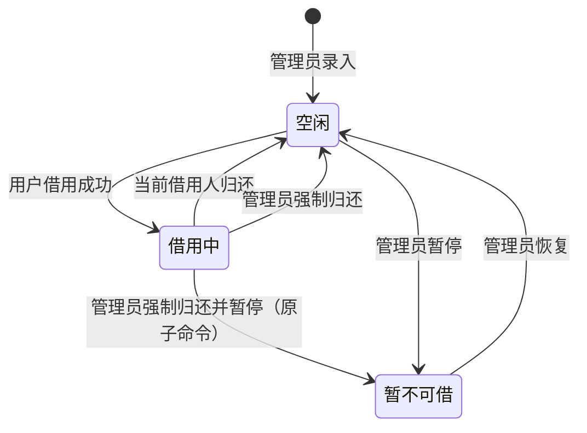
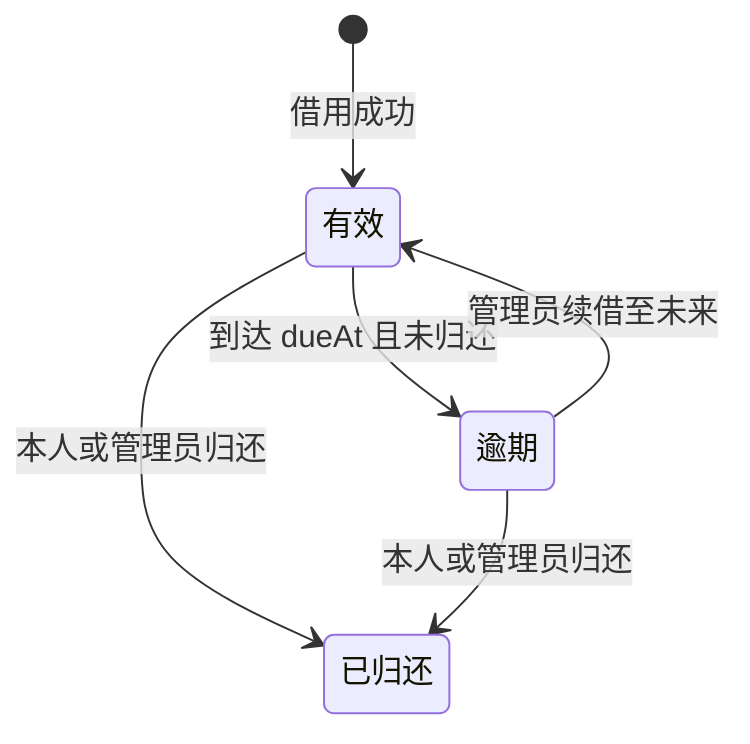

# 手机设备借用管理系统需求规格说明书

| 项目 | 内容 |
| --- | --- |
| 文档版本 | v1.0 |
| 文档状态 | 已批准开发 |
| 编制日期 | 2026-09-01 |
| 目标读者 | 业务负责人、测试组管理员、研发、测试、运维 |
| 对应设计 | [开发设计文档](development-design.md) |
| 对应测试 | [测试方案](test-plan.md) |

> 业务负责人已于 2026-09-01 确认本需求基线。公司域名、管理员邮箱、SMTP 和对象存储端点通过环境配置提供；本地演示值不得直接用于生产。

## 1. 背景与目标

测试组持有多台不同档位的手机，现有借用信息容易分散在线下沟通中，无法稳定回答“有哪些设备、谁正在使用、何时应归还、为何不可借、谁修改了记录”等问题。本系统用于建立唯一、可追溯的设备借用台账。

系统目标：

1. 公司员工可使用公司邮箱注册并登录。
2. 所有已登录员工可查询测试组手机及当前可借状态。
3. 用户可原子地借用空闲设备，并自行归还本人借用的设备。
4. 测试组管理员可维护设备、处理异常归还、暂停借用、续借及期限配置。
5. 所有关键变更可审计，并在并发操作、服务重启和通知失败时保持数据一致。
6. 系统每天仅在约定时段开放交互访问。

## 2. 成功指标

- 设备借用以系统记录为唯一业务台账，同一设备任何时刻最多只有一名当前借用人。
- 设备列表能明确展示空闲、借用中、暂不可借三种状态。
- 关键借用、归还、续借及管理员操作可追溯到操作者和时间。
- 并发抢借同一设备时只有一个请求成功，不出现双重借用或部分写入。
- 到期不会自动把实体尚未归还的设备释放为空闲。
- 开放时段内，核心流程满足本文定义的性能、可用性和安全基线。

## 3. 范围

### 3.1 MVP 范围

- 公司邮箱注册、邮箱验证、密码登录、退出和找回密码。
- 普通用户、测试组管理员两种业务角色。
- 设备新增、编辑、归档、展示图、档位及暂不可借管理。
- 设备搜索、筛选、详情、当前借用人和到期时间展示。
- 借用、本人归还、管理员强制归还、逾期识别和管理员续借。
- 默认借期配置、服务开放时段控制、邮件通知、借用历史和审计日志。
- 响应式 Web 界面、基础监控、备份和恢复验证。

### 3.2 明确不在 MVP 范围

- 原生 iOS/Android App、MDM 远程控制。
- 预约、候补、转借、审批流、押金或费用结算。
- 采购、财务、折旧、报废和维修工单。
- 企业 SSO/AD、MFA、离职自动同步。
- 二维码盘点、配件成套管理、多地点调拨、复杂统计报表。
- 自动判断实体设备已归还或自动解除当前借用关系。

## 4. 评审决策清单

下表中的推荐值已作为 v1.0 开发基线；外部环境值在部署时提供。

| 决策编号 | 议题 | 推荐默认值 | 当前状态 |
| --- | --- | --- | --- |
| DEC-001 | 产品形态与网络范围 | 公司内网/VPN 可访问的响应式 Web，不对公网开放 | 已确认 |
| DEC-002 | 注册范围 | 仅允许配置的公司邮箱域；域名经 IDNA/小写规范化后精确匹配，子域和别名域需单独列入；邮箱验证后激活 | 已确认，域名部署配置 |
| DEC-003 | 首位管理员 | 通过一次性部署命令创建；用户不能在注册参数中自授管理员 | 已确认，邮箱部署时提供 |
| DEC-004 | 服务开放时段 | `Asia/Shanghai` 每天 `[09:00:00, 19:00:00)`，含周末 | 已确认 |
| DEC-005 | 下线含义 | 当前基线为严格全站关闭：普通用户和管理员的注册、登录、查询及写操作均返回关闭页；仅静态资源、私网健康检查和后台任务继续 | 已确认，不设应急入口 |
| DEC-006 | 19:00 在途请求 | 19:00 前通过中间件的读取可完成；写事务获得锁后再次检查时间，19:00 后尚未通过检查的写请求回滚 | 已确认 |
| DEC-007 | 普通借用默认期限 | 初始全局策略为从借用成功起精确 24 小时，不按自然日；在管理员修改全局策略前，这也是普通用户不可自行突破的期限。到期只标记逾期，不自动归还 | 已确认 |
| DEC-008 | 管理员改期 | 全局期限为 60 分钟至 7 天；单笔续借以“原到期时间与操作时间中较晚者”为基准增加 60 分钟至 7 天，且新到期时间不得晚于操作时刻后 7 天；全局修改仅影响新借用，改期必须填写原因 | 已确认 |
| DEC-009 | 每人同时借用数量 | MVP 不设数量上限，只限制同一设备不能重复借用 | 已确认 |
| DEC-010 | 暂不可借流转 | 借用中不能直接改字段；管理员使用“强制归还并暂停”原子命令，在一个事务内关闭借用并设为暂不可借 | 已确认 |
| DEC-011 | “截图”定义 | 定义为设备展示图；JPG/PNG/WebP，单张主图，最大 5 MB、最长边 4,096px、总像素不超过 16MP；临时孤儿对象 24 小时后清理 | 已确认，MVP 单图 |
| DEC-012 | 设备唯一标识 | 增加必填且唯一的内部资产编号，同型号多台设备据此区分 | 已确认，编号外部提供 |
| DEC-013 | 借用人信息可见性 | 普通用户只看到真实姓名和到期时间；邮箱、序列号、IMEI 仅管理员可见 | 已确认 |
| DEC-014 | 通知 | 邮件发送借用成功、到期前 2 小时、到期、续借、本人归还和强制归还通知；若提前提醒时间距创建不足 5 分钟则跳过该次提前提醒；管理员看逾期列表 | 已确认，SMTP 部署配置 |
| DEC-015 | 留存与恢复 | 审计 2 年、应用日志 90 天、已处理通知 payload 30 天、死信 90 天、备份 35 天；目标 `RPO <= 24h`、`RTO <= 4h` | 已确认 |
| DEC-016 | 规模基线 | 最多 1,000 个账户、2,000 台设备、峰值 100 并发用户 | 已确认 |
| DEC-017 | 推荐技术栈 | `.NET 10 LTS + ASP.NET Core + PostgreSQL 18` 模块化单体 | 已确认 |
| DEC-018 | 认证参数 | 密码 12-128 字符并拒绝常见泄露密码；邮箱验证 24 小时、重置链接 30 分钟；会话空闲 30 分钟、绝对 12 小时；登录同账户 15 分钟内失败 5 次锁定 15 分钟，验证/重置邮件每账户每小时最多 3 次 | 已确认 |

## 5. 角色与权限

“当前借用人”是用户在某一设备上的上下文身份，不是第三种账户角色。`TEST_ADMIN` 是“测试组管理员”的业务角色简称；“系统负责人”是拥有受控部署权限的运维主体，不是第三种产品角色。管理员借设备时也遵循普通用户借用规则。

| 操作 | 未登录 | 普通用户 | 当前借用人 | 测试组管理员 |
| --- | :---: | :---: | :---: | :---: |
| 注册、登录、找回密码 | 允许 | 不适用 | 不适用 | 不适用 |
| 查看设备和三种借用状态 | 拒绝 | 允许 | 允许 | 允许 |
| 查看借用人真实姓名、到期时间 | 拒绝 | 允许 | 允许 | 允许 |
| 借用空闲设备 | 拒绝 | 允许 | 允许借其他设备 | 允许 |
| 归还当前设备 | 拒绝 | 拒绝 | 允许 | 允许强制归还 |
| 直接修改借用人或转借 | 拒绝 | 拒绝 | 拒绝 | 拒绝，必须先归还再借用 |
| 续借、修改单笔到期时间 | 拒绝 | 拒绝 | 拒绝 | 允许，需填写原因 |
| 新增、编辑、归档设备 | 拒绝 | 拒绝 | 拒绝 | 允许 |
| 设置、解除暂不可借 | 拒绝 | 拒绝 | 拒绝 | 允许，需填写原因 |
| 查看本人借用历史 | 拒绝 | 允许 | 允许 | 允许 |
| 查看全量借用和审计记录 | 拒绝 | 拒绝 | 拒绝 | 允许 |
| 修改默认借期 | 拒绝 | 拒绝 | 拒绝 | 允许，需填写原因 |
| 授予管理员角色 | 拒绝 | 拒绝 | 拒绝 | MVP 产品界面不开放，由系统负责人执行 |

所有“允许”均以当前处于开放时段为前提。所有授权必须在服务端验证；隐藏按钮、禁用控件或前端路由保护不能替代服务端权限校验。管理员作为当前借用人归还本人设备时走普通归还流程，不要求强制归还原因。

## 6. 领域规则

### 6.1 设备借用状态

设备对外展示的三种状态不是任意可写字段：

- 存在未归还借用记录时，状态派生为“借用中”。
- 不存在未归还借用且管理员暂停时，状态为“暂不可借”。
- 其他有效设备状态为“空闲”。
- 归档是设备生命周期状态，不属于三种借用状态；归档设备默认不在设备列表显示。

### 6.2 借用记录状态

“逾期”由未归还记录和当前时间派生。即使提醒任务失败，逾期判断也必须正确。

### 6.3 不变量与禁止行为

- 每台设备最多存在一条未归还借用记录。
- “借用中”设备必须且只能对应一条未归还借用记录。
- 到期不等于实体归还，系统不得自动将设备改为空闲。
- 暂不可借设备不能创建借用记录。
- 借用中设备不能直接换借用人，也不能通过通用状态编辑改为暂不可借；只有“强制归还并暂停”原子命令可在关闭借用的同时进入暂不可借。
- 当前借用人只能归还本人设备，不能自助续借或修改借用期限。
- 设备、借用、审计及通知事件必须在同一业务事务中保持一致；通知实际发送可异步。
- 并发操作失败必须返回稳定业务错误，不能覆盖胜出请求或产生部分数据。

## 7. 功能需求

### 7.1 账户与会话

- `REQ-AUTH-001` 系统应支持邮箱、密码、真实姓名注册，三项均为必填。
- `REQ-AUTH-002` 邮箱应去除首尾空格、按不区分大小写方式保持唯一，并限制为公司邮箱域。
- `REQ-AUTH-003` 用户完成邮箱验证后账户方可激活；过期验证链接可重新发送。
- `REQ-AUTH-004` 新注册账户只能获得普通用户角色，客户端提交角色字段应被忽略或拒绝。
- `REQ-AUTH-005` 系统应支持登录、退出、忘记密码、一次性重置密码链接和会话失效；邮箱验证链接有效 24 小时，密码重置链接有效 30 分钟，会话空闲 30 分钟或累计 12 小时后失效。
- `REQ-AUTH-006` 密码长度应为 12-128 字符并拒绝常见/已泄露密码；同一规范化账户 15 分钟内登录失败 5 次后锁定 15 分钟，验证和重置邮件每账户每小时最多 3 次；界面和响应时间不得泄露邮箱是否已注册。
- `REQ-AUTH-007` 被停用或降权账户不能继续使用旧权限；受保护请求应重新校验当前账户状态，关键写事务应在事务内重新校验操作者角色。
- `REQ-AUTH-008` 账户停用不得删除或自动关闭其借用和审计记录；如存在未归还借用，应进入管理员异常清单并由管理员联系借用人后处理。
- `REQ-AUTH-009` 管理员晋升、降级和停用只通过受控运维命令调用同一应用服务；必须记录运维操作者、目标账户、前后角色和原因，不得降级或停用最后一名有效管理员，并立即使目标旧会话失效。

### 7.2 设备目录

- `REQ-DEV-001` 所有已登录用户应能查看未归档设备列表和详情。
- `REQ-DEV-002` 列表应支持按型号/资产编号搜索，按状态和低/中/高端档位筛选。
- `REQ-DEV-003` 管理员创建设备时必须录入唯一资产编号、型号名称、展示图和档位。
- `REQ-DEV-004` 管理员可维护品牌、操作系统、内存/存储、序列号、IMEI、存放位置、备注等补充信息；这些字段必须进入数据模型和审计快照。
- `REQ-DEV-005` 序列号、IMEI、管理员备注等敏感资产字段只对管理员展示，普通用户列表、详情、局部 HTML 和任何序列化响应均不得包含。
- `REQ-DEV-006` 展示图只接受 JPG/PNG/WebP；执行文件魔数和完整解码校验，限制 5 MB、最长边 4,096px、总像素 16MP，禁止 SVG、动画与可执行内容，移除 EXIF 后重新编码。
- `REQ-DEV-007` 管理员可编辑、归档和恢复设备；归档需要二次确认并填写原因。存在未归还借用的设备不得归档，有历史记录的设备不得物理删除。
- `REQ-DEV-008` 管理员可对空闲设备设置或解除暂不可借，并必须填写原因。
- `REQ-DEV-009` 借用中设备如需暂停，管理员必须执行“强制归还并暂停”原子命令；该命令在同一事务内关闭借用、记录原因和设置暂不可借，不得暴露短暂空闲窗口。
- `REQ-DEV-010` 管理员编辑设备应有并发版本检查，避免静默覆盖他人修改。

### 7.3 借用、归还与续借

- `REQ-LOAN-001` 已登录用户可在开放时段借用空闲设备；MVP 不限制同一用户同时借用不同设备的数量，不得建立 borrower 侧唯一约束。
- `REQ-LOAN-002` 初始借期策略为 1,440 分钟。借用成功应在获得业务锁后从权威时钟读取一次 `effectiveNow`，同时用作开放时段复检、借用时间、`dueAt = effectiveNow + 当前策略时长` 和提醒计算基准，并记录策略版本；不得使用浏览器或请求到达时间起算借期。
- `REQ-LOAN-003` 普通用户不能指定借用人或自行延长默认期限。
- `REQ-LOAN-004` 借用必须在数据库事务内重新校验设备状态，并以数据库唯一约束防止双重借用。
- `REQ-LOAN-005` 并发抢借同一设备时恰好一个请求成功，其余请求返回 `409 DEVICE_ALREADY_BORROWED`。
- `REQ-LOAN-006` 借用中设备应向已登录用户显示当前借用人真实姓名和到期时间，不显示邮箱。
- `REQ-LOAN-007` 当前借用人可归还本人未归还的设备；其他普通用户不得代为归还。
- `REQ-LOAN-008` 管理员可强制归还任意未归还设备，且必须填写原因；管理员归还本人借用时按普通本人归还处理，无需原因。
- `REQ-LOAN-009` 归还应关闭当前借用记录；普通归还或单独强制归还后设备为空闲，“强制归还并暂停”后设备直接为暂不可借。
- `REQ-LOAN-010` 系统不得直接转借；新用户只能在上一借用记录归还后重新借用。
- `REQ-LOAN-011` 到达 `dueAt` 后记录应显示逾期，设备仍保持借用中并保留借用人。
- `REQ-LOAN-012` 管理员可把有效或逾期记录的到期时间延长；以原到期时间与操作时间中较晚者为基准，延长量为 60 分钟至 7 天，且新到期时间不得晚于操作时刻后 7 天，并记录旧值、新值和原因。
- `REQ-LOAN-013` 管理员修改全局默认借期只影响此后创建的借用记录，不追溯现有记录。
- `REQ-LOAN-014` 用户可查看本人当前借用和历史记录；管理员可查看、搜索全量借用记录。

### 7.4 服务开放时间

- `REQ-TIME-001` 服务端应以 `Asia/Shanghai` 计算开放时段，不信任浏览器时间或时区。
- `REQ-TIME-002` 每天 `09:00:00` 起开放，`19:00:00` 起关闭；边界定义为 `[09:00:00, 19:00:00)`。
- `REQ-TIME-003` 关闭时段的页面请求应返回可读关闭页，命令/API 应返回 `503 OUTSIDE_ACCESS_WINDOW` 和下次开放时间。
- `REQ-TIME-004` 前端、直接 HTTP 请求和旧会话均不能绕过关闭规则。
- `REQ-TIME-005` 健康检查、就绪检查、通知处理和备份任务不受交互关闭影响。
- `REQ-TIME-006` 系统不依赖 09:00/19:00 定时任务切换开关，而应在每次请求时根据服务端时间判定。
- `REQ-TIME-007` 业务时间以启用 NTP 的应用服务器 UTC 时钟为权威并转换到上海时区；19:00 前通过中间件的读取可完成。登录/退出须在签发或撤销 Cookie 前复检；注册/验证/重置、设备/图片、借用/归还/续借、设置和角色运维等所有交互写事务都必须在获得各自业务锁后通过统一门禁复检；应用与数据库时钟偏差超过 2 秒应告警。

### 7.5 通知

- `REQ-NOTIFY-001` 借用成功后应向借用人发送确认邮件，包含设备、借用时间和到期时间。
- `REQ-NOTIFY-002` 系统应在到期前 2 小时和到期时发送提醒；若提前提醒计划时间距创建不足 5 分钟则只保留到期提醒；管理员续借后发送新的到期时间。
- `REQ-NOTIFY-003` 管理员强制归还后应通知原借用人并包含原因。
- `REQ-NOTIFY-004` 通知失败不得回滚已成功的借用事务。明确未被 SMTP 接受的临时失败应自动重试，明确永久拒绝进入死信；超时、进程崩溃等“是否已被接受”不确定的失败进入人工复核且不自动重发。
- `REQ-NOTIFY-005` 同一业务事件重复处理时不得重复创建站内记录；邮件采用至少一次发送尝试并尽力去重，不承诺每次尝试都被外部 SMTP 接受。投递记录只保存用户 ID 或加密接收地址，错误文本净化，管理员界面仅显示脱敏地址。
- `REQ-NOTIFY-006` 提醒与逾期判定在交互关闭时段仍应运行。
- `REQ-NOTIFY-007` 当前借用人本人归还后应收到归还确认；归还事务应取消仍待处理的到期提醒。
- `REQ-NOTIFY-008` 续借或归还必须取消仍为 `PENDING` 的旧提醒。Worker 在同一原子 CAS 中复检聚合版本并把 `CLAIMED` 转为不可撤回的 `SENDING`；只有完成该转换的单条消息可能在业务随后变化后仍送达。`SENDING` 阶段只有“是否被 SMTP 接受”不确定的故障进入人工复核且不得自动重发；明确未接受的失败仍按 REQ-NOTIFY-004 处理。系统不承诺严格零重复或硬性陈旧时间上界。

通知矩阵：

| 事件 | 接收人 | 时机 | 失败策略 |
| --- | --- | --- | --- |
| 注册验证、密码重置 | 目标用户 | 立即 | 限流后可重新请求，不泄露账户存在性 |
| 借用成功 | 当前借用人 | 事务提交后尽快 | Outbox 重试，业务不回滚 |
| 到期前提醒 | 当前借用人 | `dueAt - 2h`；距创建不足 5 分钟则跳过 | Outbox 重试 |
| 到期提醒 | 当前借用人 | `dueAt` | Outbox 重试，逾期仍按时间派生 |
| 管理员续借 | 当前借用人 | 事务提交后尽快 | 取消旧未发提醒并创建新计划 |
| 本人归还 | 原借用人 | 事务提交后尽快 | Outbox 重试 |
| 强制归还/强制归还并暂停 | 原借用人 | 事务提交后尽快 | 邮件包含原因，Outbox 重试 |
| 通知最终失败 | 测试组管理员 | 管理后台实时列表 | 触发告警，人工处理 |

### 7.6 管理配置、历史与审计

- `REQ-ADMIN-001` 管理员可查看和修改全局默认借用时长，范围为 60 分钟至 7 天。
- `REQ-ADMIN-002` 配置修改必须记录操作者、旧值、新值、原因和生效时间。
- `REQ-AUDIT-001` 账户角色、设备、暂不可借、借用、归还、续借和配置变更均应生成不可变审计事件。
- `REQ-AUDIT-002` 审计事件至少包含操作者、事件类型、对象、按事件白名单选取的变更前后字段、原因、请求关联 ID 和 UTC 时间；不得直接保存整实体快照。
- `REQ-AUDIT-003` 密码、会话令牌、验证/重置令牌和完整安全凭据不得写入日志或审计；邮箱、IMEI、位置等 PII 只在批准字段中保留并按查看权限脱敏。
- `REQ-AUDIT-004` 普通用户可查看本人借用历史，但不能读取全量审计；管理员可按时间、操作者和对象查询。
- `REQ-AUDIT-005` 设备归档或用户停用后，相关借用和审计记录仍可查询。

## 8. 信息字段

### 8.1 用户

| 字段 | 必填 | 可见范围 | 说明 |
| --- | :---: | --- | --- |
| 邮箱 | 是 | 本人、管理员 | 登录标识，规范化后唯一 |
| 密码 | 是 | 无人可见 | 只存慢哈希，不存明文 |
| 真实姓名 | 是 | 已登录用户 | 用于展示当前借用人 |
| 角色 | 是 | 本人、管理员 | `USER` 或 `TEST_ADMIN` |
| 账户状态 | 是 | 本人、管理员 | 待验证、启用、停用 |

### 8.2 设备

| 字段 | 必填 | 可见范围 | 说明 |
| --- | :---: | --- | --- |
| 资产编号 | 是 | 已登录用户 | 同型号多台设备的唯一标识 |
| 型号名称 | 是 | 已登录用户 | 例如 iPhone 16 Pro |
| 展示图 | 是 | 已登录用户 | 主图一张，受控访问 |
| 档位 | 是 | 已登录用户 | `LOW`、`MID`、`HIGH` |
| 品牌、系统、规格、位置 | 否 | 已登录用户 | 提升检索和识别效率 |
| 序列号、IMEI | 否 | 仅管理员 | 敏感资产信息 |
| 暂不可借原因 | 状态相关 | 已登录用户 | 暂不可借时必填 |
| 备注 | 否 | 管理员 | 不得填写密码或个人敏感信息 |

### 8.3 借用记录

设备、借用人、借出时间、到期时间、归还时间、归还操作者、归还类型、续借次数、策略版本、强制操作原因及审计关联 ID。

## 9. 页面与交互要求

MVP 首屏是设备操作台，不制作营销落地页。

界面评审材料见 [最终界面预览](ui-preview/README.md)；其中 13 张桌面图、7 张移动图和总览图均使用合成数据，不代表系统已经开发。

| 页面 | 主要内容 |
| --- | --- |
| 登录/注册/找回密码 | 清晰标签、内联校验、邮箱验证状态和统一错误提示 |
| 设备列表 | 紧凑列表/表格、缩略图、型号、资产编号、档位、状态、借用人、到期时间、主要操作 |
| 设备详情 | 完整可见字段、当前借用信息、借用或归还操作 |
| 我的借用 | 当前借用、逾期提示、历史记录 |
| 管理员设备管理 | 新增、编辑、归档、暂停/恢复借用 |
| 管理员借用管理 | 当前、逾期、续借、强制归还 |
| 管理设置与审计 | 默认期限、审计查询、通知失败列表 |
| 关闭页 | 当前关闭原因、上海时间、下次开放时间 |

交互要求：

- 桌面端优先使用高信息密度表格；窄屏转换为可扫描列表，不让宽表溢出页面。
- 状态必须同时使用文字和视觉标记，不能只依赖颜色。
- 借用、归还按钮提交期间禁用，提供成功、失败和并发冲突反馈。
- 管理员强制归还、归档、暂停借用等高影响操作需要确认和原因输入。
- 所有功能可通过键盘完成，焦点顺序与视觉顺序一致，焦点样式可见。
- 图片提供替代文本；表单字段具有持久标签；界面满足 WCAG 2.2 AA。
- 动效仅用于状态反馈，遵循 `prefers-reduced-motion`，不使用会改变布局尺寸的悬停效果。

## 10. 非功能需求

### 10.1 安全与隐私

- `NFR-SEC-001` 生产环境全站 HTTPS，Cookie 使用 `Secure`、`HttpOnly` 和适当的 `SameSite`。
- `NFR-SEC-002` 密码使用平台推荐的慢哈希并支持参数升级；登录、重置和验证接口限流。
- `NFR-SEC-003` 所有写操作防 CSRF；输出编码防 XSS；上传文件在 Web 根目录之外的私有存储保存。含 PII 的页面、片段和图片使用鉴权读取并返回 `Cache-Control: private, no-store`、`Vary: Cookie` 和不泄露 URL 的 Referrer 策略。
- `NFR-SEC-004` 权限执行角色级和对象级双重校验，覆盖直接请求与批量赋值攻击。
- `NFR-SEC-005` 管理员敏感操作和重复越权尝试产生安全日志与告警上下文。
- `NFR-SEC-006` 会话与一次性令牌所用的加密密钥环必须持久化、静态加密、限制访问并纳入备份恢复；多 Web 实例必须共享兼容密钥。推荐 .NET 实现对应 ASP.NET Core Data Protection。

### 10.2 一致性与可靠性

- `NFR-REL-001` 数据库约束必须保证每台设备最多一条未归还借用记录。
- `NFR-REL-002` 服务重启、通知服务不可用或用户重复提交时，不得破坏设备与借用状态一致性。
- `NFR-REL-003` 每日备份数据库、图片和运行配置，并完成至少一次隔离恢复演练。

### 10.3 性能与可用性

- `NFR-PERF-001` 在 DEC-016 规模下，列表和详情请求 `P95 <= 1s`，借用和归还 `P95 <= 2s`；5xx 与非预期 4xx 的技术错误率 `< 1%`，预期并发 409 单独统计且不计入技术错误率。
- `NFR-PERF-002` 100 个并发请求抢借同一设备时，恰好一个成功，其余返回业务冲突且无脏数据。
- `NFR-AVL-001` 排除计划关闭时段后，月可用性目标不低于 99.5%。

### 10.4 兼容、可访问与可观测

- `NFR-COMP-001` 支持公司标准 Windows Edge、Chrome 的当前和前一主版本；正式交互布局从 360px 起可用，并在 320 CSS px 等效宽度下满足可访问性回流。
- `NFR-A11Y-001` 核心流程满足 WCAG 2.2 AA：支持键盘、跳转到主内容、可访问名称、最小 24×24 CSS px 目标、400% 缩放/320 CSS px 回流，并通过 NVDA 人工检查；触屏主操作点击区域目标为 44×44 CSS px。
- `NFR-OBS-001` 监控 5xx、延迟、数据库连接、借用冲突、最老待发通知、邮件失败、磁盘、证书、应用与数据库时钟偏差和备份新鲜度；时钟偏差超过 2 秒告警。

## 11. 统一业务错误

| HTTP | 业务码 | 含义 |
| --- | --- | --- |
| 400 | `VALIDATION_FAILED` | 字段或业务参数不合法 |
| 401 | `AUTHENTICATION_REQUIRED` | 未登录或会话失效 |
| 403 | `FORBIDDEN` | 角色或对象级权限不足 |
| 404 | `RESOURCE_NOT_FOUND` | 对象不存在或调用者不可见 |
| 409 | `DEVICE_ALREADY_BORROWED` | 设备已被其他请求借用 |
| 409 | `STATE_TRANSITION_NOT_ALLOWED` | 当前状态不允许该操作 |
| 409 | `EDIT_VERSION_CONFLICT` | 管理编辑版本冲突 |
| 422 | `REASON_REQUIRED` | 管理操作缺少原因 |
| 429 | `RATE_LIMITED` | 登录、验证或重置请求超过统一限制；返回 `Retry-After`，不透露账户是否存在 |
| 503 | `OUTSIDE_ACCESS_WINDOW` | 当前处于计划关闭时段 |

## 12. 核心验收场景

| 验收编号 | 场景与预期 |
| --- | --- |
| AC-001 | 公司邮箱验证后可登录；非公司域、重复邮箱、空真实姓名均被拒绝 |
| AC-002 | 普通用户直接调用设备管理、续借、暂不可借和全量审计入口均被拒绝且数据不变 |
| AC-003 | 管理员缺少资产编号、型号、展示图或合法档位时不能创建设备，资产编号不可重复 |
| AC-004 | 已登录用户可见借用人的真实姓名和到期时间，但不可见其邮箱、序列号或 IMEI |
| AC-005 | 两名及以上用户同时抢借同一空闲设备时恰好一人成功，只生成一条未归还记录 |
| AC-006 | 本人归还后设备变为空闲；其他普通用户归还被拒绝；管理员替他人强制归还必须填写原因，归还本人设备无需强制原因 |
| AC-007 | 暂不可借设备不能借用；普通用户不能设置该状态；借用中通用暂停被拒绝，“强制归还并暂停”原子命令直接进入暂不可借且无空闲窗口 |
| AC-008 | 上海时间 08:59:59 和 19:00:00 关闭，09:00:00 和 18:59:59 开放，直接 HTTP 请求也不能绕过 |
| AC-009 | 10:30 借用默认次日 10:30 到期；到期后记录逾期但设备仍借用中并保留借用人 |
| AC-010 | 管理员可把到期时间延至未来且不晚于操作时刻后 7 天；普通用户不能续借；前后值、操作者和原因进入审计 |
| AC-011 | 设备不能直接转借，必须归还后重新借用并形成两段独立记录 |
| AC-012 | 未归还设备不能归档；归档设备和停用账户不参与新业务，停用借用人进入异常清单，历史借用及审计仍可查询 |
| AC-013 | 通知提供商失败时借用仍成功，待发通知重试且业务事件不重复 |
| AC-014 | 服务重启后借用、到期和旧会话密钥策略保持一致；备份恢复后满足设备/借用不变量并对待发消息执行受控重放 |
| AC-015 | 规模基线下满足性能目标，且并发测试不产生重复未归还记录 |
| AC-016 | 受控运维命令可晋升/降级管理员并立即撤销旧权限；最后一名有效管理员不能被降级或停用，操作完整审计 |
| AC-017 | 展示图超过 5 MB、4,096px 最长边或 16MP，或内容不是合法 JPG/PNG/WebP 时被拒绝，失败不改变现有图片 |

## 13. 需求批准条件

DEC-001 至 DEC-018 已确认。本文授权进入开发与测试，不授权部署生产或导入真实员工数据；生产发布仍需独立批准。
